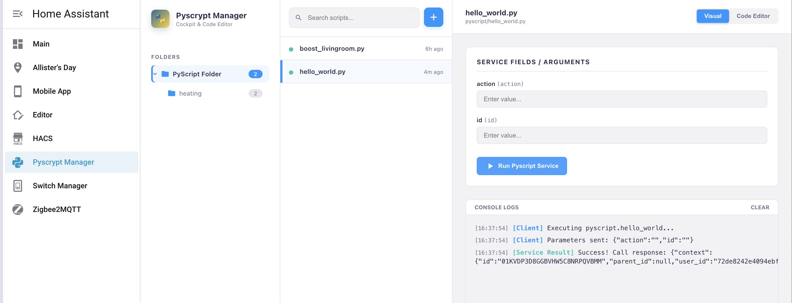

# Pyscrypt Manager

A dedicated Home Assistant custom panel integration that provides a full-page sidebar application to list, configure, and execute Python scripts installed via the [pyscript](https://github.com/custom-components/pyscript) integration.

Unlike Lovelace dashboards, this runs as a **dedicated application** directly registered on your Home Assistant sidebar, offering a clean, distraction-free workspace.


## Preview



## Features

- 🐍 **Dedicated Sidebar App**: Registers as a native sidebar panel app (`/pyscrypt-manager`), bypassing the need for dashboard cards.
- ⚙️ **Dynamic Argument Forms**: Translates script parameters (text inputs, selects, toggles, number sliders) into responsive UI form controls.
- ⚡ **Interactive Terminal Console**: Shows real-time loader indicators, success/failure execution states, and formats returned JSON payload outputs.
- 🔄 **Core Integration Controls**: Features a "Reload Pyscripts" trigger to refresh scripts instantly without leaving the app.
- 🔍 **Fuzzy Searching & Filtering**: Search bar and quick-filters for custom user scripts vs. system helpers.
- 💎 **Premium Glassmorphic Workspace**: Full-screen dark-themed dashboard tailored to high-density desktop displays.

## Installation & Setup

You can install **Pyscrypt Manager** either automatically via HACS (recommended) or manually.

### Option A: Install via HACS (Recommended)

Since this is a custom integration not yet in the default HACS store, you need to add it as a Custom Repository:

1. **Open HACS:** Navigate to **HACS** in your Home Assistant sidebar.
2. **Access Custom Repositories:** Click on the three dots (`...`) in the top-right corner of the HACS dashboard and select **Custom repositories**.
3. **Add Repository:**
   - **Repository:** Enter the URL: `https://github.com/allistera/pyscrypt-manager`
   - **Category:** Select **Integration**.
   - Click **Add**.
4. **Download:** The repository will now appear in HACS. Click on it, select **Download** (in the bottom right), and choose the latest version.
5. **Add to Configuration:** Add the domain entry to your Home Assistant `configuration.yaml` file:
   ```yaml
   pyscrypt_manager:
   ```
6. **Restart:** Restart Home Assistant Core to initialize the integration. Once restarted, the **Pyscrypt Manager** sidebar icon will appear automatically.

---

### Option B: Manual Installation

If you prefer to install it manually, copy the files directly into your configuration folder:

1. **Copy Component Files:** Copy the `pyscrypt_manager` folder inside `custom_components` to your Home Assistant configuration directory under `custom_components/pyscrypt_manager/`.
   ```bash
   cp -r custom_components/pyscrypt_manager /path/to/home-assistant/config/custom_components/
   ```
2. **Add to Configuration:** Add the domain configuration to your `configuration.yaml`:
   ```yaml
   pyscrypt_manager:
   ```
3. **Restart:** Restart Home Assistant Core.

---

## File Structure

- `custom_components/pyscrypt_manager/`
  - `__init__.py` — Bootstraps the backend WebSocket API and registers the custom sidebar panel.
  - `manifest.json` — Defines integration properties, owners, and HA dependencies.
  - `pyscrypt-manager-panel.js` — The full front-end client interface built with theme-aware Dynatrace CSS variables and a custom regex-based syntax highlighter.
- `hacs.json` — HACS metadata file defining integration compatibility.

